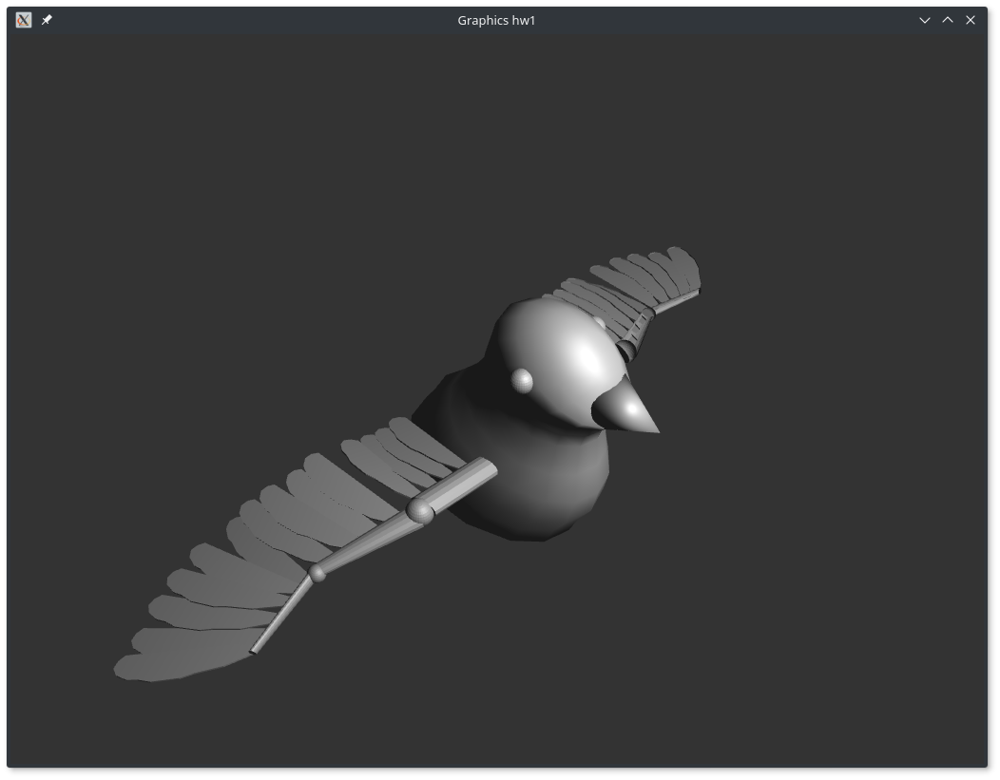

# hw1 : Hierarchical model

==========================

## Recommended Environment

 - Linux
 - OpenGL >= 3.0
 - C++ >= 6.3.1
 - CMake >= 3.7.2

## Execution
 1. `mkdir build` (At root directory, where `CMakeLists.txt` is contained)
 1. `cd build`
 1. `cmake ..`
 1. `make`
 1. `cd ../hw1/` (Directory should be correct, since it loads `obj` and shader files in relative path)
 1. `./hw1`

